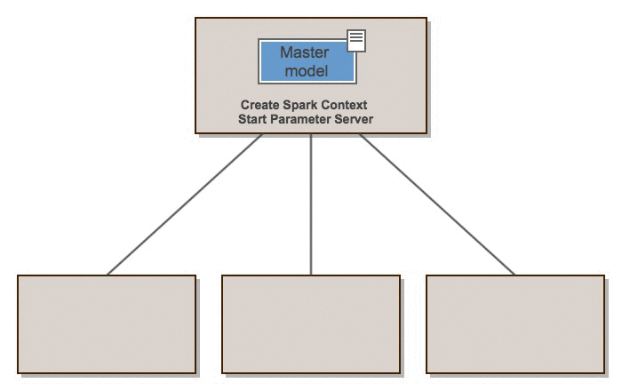

# Elephas: Keras Deep Learning on Apache Spark

## Introduction
Elephas brings deep learning with [Keras](http://keras.io) to [Apache Spark](http://spark.apache.org). Elephas intends to keep the simplicity and usability of Keras, allowing for fast prototyping of distributed models to run on large data sets.

ἐλέφας is Greek for _ivory_ and an accompanying project to κέρας, meaning _horn_. If this seems weird mentioning, like a bad dream, you should confirm it actually is at the [Keras documentation](https://github.com/fchollet/keras/blob/master/README.md). Elephas also means _elephant_, as in stuffed yellow elephant.

Elephas implements a class of data-parallel algorithms on top of Keras, using Spark's RDDs and data frames. Keras Models are initialized on the driver, then serialized and shipped to workers, alongside with data and broadcasted model parameters. Spark workers deserialize the model, train their chunk of data and send their gradients back to the driver. The "master" model on the driver is updated by an optimizer, which takes gradients either synchronously or asynchronously.




## Getting started

### Installation
Install elephas from PyPI with 
```
pip install elephas
```
A quick way to install Spark locally is to use homebrew on Mac 
```
brew install spark
```
or linuxbrew on linux
```
brew install apache-spark
```
If this is not an option, you should simply follow the instructions at the [Spark download section](http://spark.apache.org/downloads.html). 

### Basic example
After installing both Elephas and Spark, training a model is done schematically as follows:

- Create a local pyspark context
```python
from pyspark import SparkContext, SparkConf
conf = SparkConf().setAppName('Elephas_App').setMaster('local[8]')
sc = SparkContext(conf=conf)
```

- Define and compile a Keras model
```python
model = Sequential()
model.add(Dense(128, input_dim=784))
model.add(Activation('relu'))
model.add(Dropout(0.2))
model.add(Dense(128))
model.add(Activation('relu'))
model.add(Dropout(0.2))
model.add(Dense(10))
model.add(Activation('softmax'))
model.compile(loss='categorical_crossentropy', optimizer=SGD())
```

- Create an RDD from numpy arrays 
```python
from elephas.utils.rdd_utils import to_simple_rdd
rdd = to_simple_rdd(sc, X_train, Y_train)
```

- A SparkModel is defined by passing Spark context and Keras model. Additionally, one has choose an optimizer used for updating the elephas model, an update frequency, a parallelization mode and the degree of parallelism, i.e. the number of workers.
```python
from elephas.spark_model import SparkModel
from elephas import optimizers as elephas_optimizers

adagrad = elephas_optimizers.Adagrad()
spark_model = SparkModel(sc,model, optimizer=adagrad, frequency='epoch', mode='asynchronous', num_workers=2)
spark_model.train(rdd, nb_epoch=20, batch_size=32, verbose=0, validation_split=0.1, num_workers=8)
```

- Run your script using spark-submit
```
spark-submit --driver-memory 1G ./your_script.py
```
Increasing the driver memory even further may be necessary, as the set of parameters in a network may be very large and collecting them on the driver eats up a lot of resources. See the examples folder for a few working examples.

### Spark MLlib example
Following up on the last example, to create an RDD of LabeledPoints for supervised training from pairs of numpy arrays, use 
```python
from elephas.utils.rdd_utils import to_labeled_point
lp_rdd = to_labeled_point(sc, X_train, Y_train, categorical=True)
```
Training a given LabeledPoint-RDD is very similar to what we've seen already
```python
from elephas.spark_model import SparkMLlibModel
adadelta = elephas_optimizers.Adadelta()
spark_model = SparkMLlibModel(sc,model, optimizer=adadelta, frequency='batch', mode='hogwild', num_workers=2)
spark_model.train(lp_rdd, nb_epoch=20, batch_size=32, verbose=0, validation_split=0.1, categorical=True, nb_classes=nb_classes)
```

### Spark ML example
To train a model with a SparkML estimator on a data frame, use the following syntax.
```python
df = to_data_frame(sc, X_train, Y_train, categorical=True)
test_df = to_data_frame(sc, X_test, Y_test, categorical=True)

adadelta = elephas_optimizers.Adadelta()
estimator = ElephasEstimator(sc,model, 
        nb_epoch=nb_epoch, batch_size=batch_size, optimizer=adadelta, frequency='batch', mode='asynchronous', num_workers=2,
        verbose=0, validation_split=0.1, categorical=True, nb_classes=nb_classes)

fitted_model = estimator.fit(df)
```

Fitting an estimator results in a SparkML transformer, which we can use for predictions and other evaluations by calling the transform method on it.

``` python
prediction = fitted_model.transform(test_df)
pnl = prediction.select("label", "prediction")
pnl.show(100)

prediction_and_label= pnl.map(lambda row: (row.label, row.prediction))
metrics = MulticlassMetrics(prediction_and_label)
print(metrics.precision())
print(metrics.recall())
```

## Usage

Elephas models have four parameters to play with and we will describe each of them next. 

### Model updates (optimizers)

### Update frequency

### Update mode

### Degree of parallelzation (number of workers)


## Discussion

## Known issues

- Integration with Spark MLLib:
  - Train and evaluate LabeledPoints RDDs
  - Make elephas models MLLib algorithms
- Integration with Spark ML:
  - Use DataFrames for training
  - Make models ML pipeline components

## Literature
